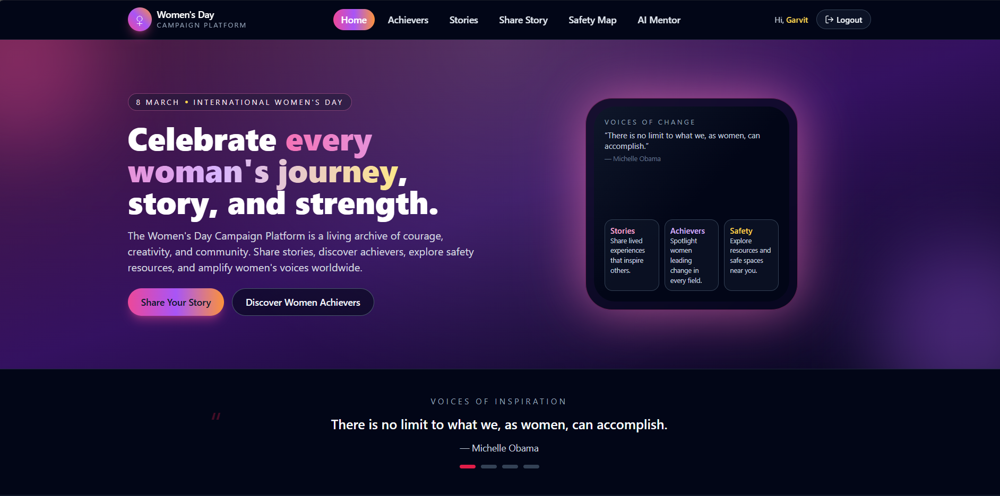
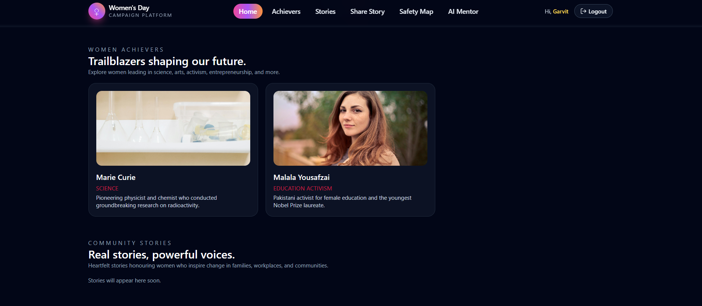
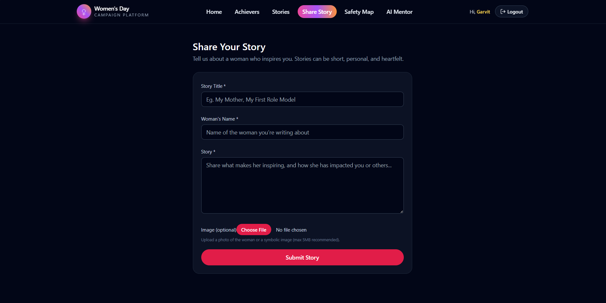
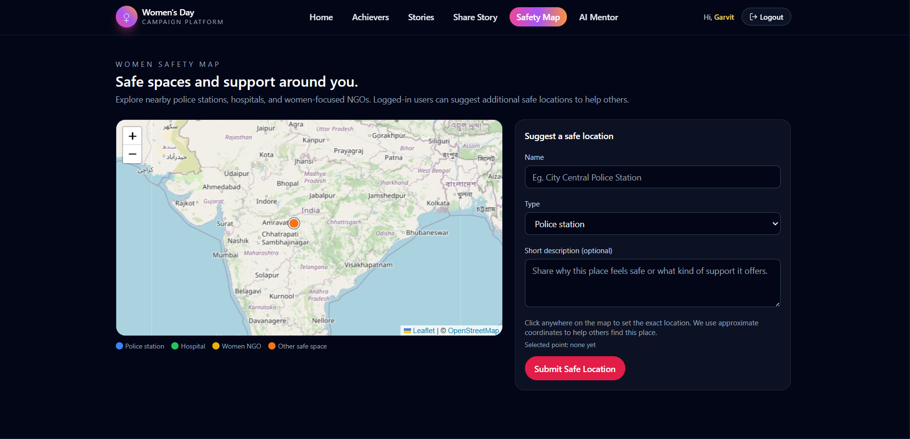
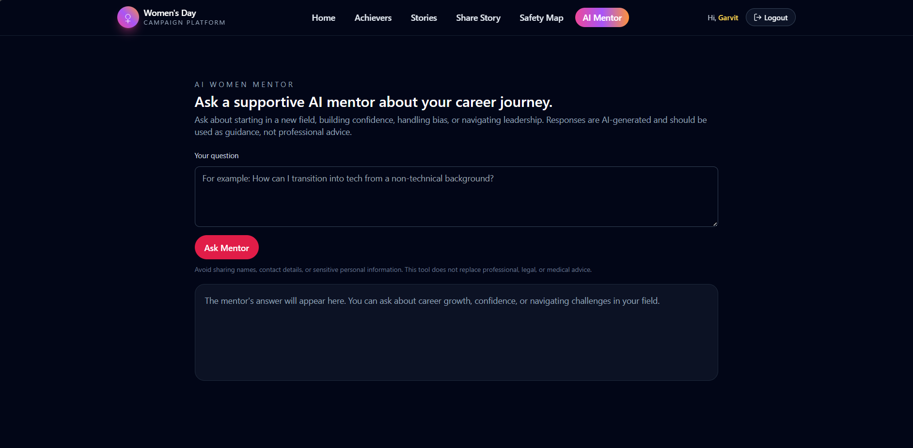

# International Women's Day Campaign Platform (MERN)

Full-stack MERN application to celebrate International Women's Day with inspirational women achievers, quotes, and community stories.

## Tech Stack

- **Frontend**: React (Vite), React Router, TailwindCSS, Axios
- **Backend**: Node.js, Express.js, MongoDB (Mongoose), JWT, bcrypt, Multer, Cloudinary

## Features

### Home Page

The landing page features an inspiring hero section with quotes and navigation to explore the platform.


### Achievers Gallery

Browse and celebrate inspirational women achievers with their stories and achievements.


### Submit Your Story

Share your own story with optional image upload to inspire others.


### Safety Map

View and contribute to a map of safe locations and resources for women.


### AI Mentor

Get guidance and support through AI-powered mentoring tools.


### Admin Dashboard

Manage users, stories, and achievers through a comprehensive admin interface.


---

## Folder Structure

## Folder Structure

- `backend/`
  - `config/` – `db.js`, `cloudinary.js`
  - `controllers/` – `authController.js`, `storyController.js`, `achieverController.js`
  - `models/` – `User.js`, `Story.js`, `Achiever.js`
  - `routes/` – `authRoutes.js`, `storyRoutes.js`, `achieverRoutes.js`
  - `middleware/` – `authMiddleware.js`, `errorMiddleware.js`
  - `seed/` – `sampleData.js`
  - `utils/` – `server.js`
  - `.env.example`
- `frontend/`
  - `src/components/` – `Navbar.jsx`, `HeroSection.jsx`, `AchieverCard.jsx`, `QuoteSlider.jsx`, `StoryCard.jsx`, `Footer.jsx`
  - `src/pages/` – `Home.jsx`, `Achievers.jsx`, `Stories.jsx`, `SubmitStory.jsx`, `Login.jsx`, `Register.jsx`
  - `src/services/` – `api.js`
  - `src/context/` – `AuthContext.jsx`
  - `src/App.jsx`, `src/main.jsx`, `src/index.css`

---

## Backend Setup

1. **Install dependencies**

```bash
cd backend
npm install
```

2. **Create `.env` file**

Copy `.env.example` to `.env` and update values:

```bash
cp .env.example .env   # on Windows PowerShell: copy .env.example .env
```

Required variables:

- `PORT` – API port (default `5000`)
- `MONGO_URI` – MongoDB connection string
- `JWT_SECRET` – secret for signing JWT tokens
- `JWT_EXPIRES_IN` – token lifetime (e.g. `7d`)
- `CLOUDINARY_*` – Cloudinary credentials
- `CLIENT_URL` – frontend URL (default `http://localhost:5173`)

3. **Run backend**

Development:

```bash
cd backend
npm run dev
```

Production-style:

```bash
cd backend
npm start
```

The API will be available at `http://localhost:5000/api`.

### Key API Endpoints

- **Auth**
  - `POST /api/auth/register` – register and receive JWT
  - `POST /api/auth/login` – login and receive JWT
- **Stories**
  - `GET /api/stories` – list stories
  - `POST /api/stories` – create story (auth required, `multipart/form-data` with `image`)
- **Achievers**
  - `GET /api/achievers` – list achievers
  - `POST /api/achievers` – create achiever (auth required)

Sample data for achievers and one story is automatically seeded in non-production environments.

---

## Frontend Setup

1. **Install dependencies**

```bash
cd frontend
npm install
```

2. **Configure API base URL (optional)**

By default, the frontend calls `http://localhost:5000/api`. To change this, create `frontend/.env`:

```bash
VITE_API_URL=http://localhost:5000/api
```

3. **Run frontend**

```bash
cd frontend
npm run dev
```

Open the app at `http://localhost:5173`.

---

## Example Flow

1. Register at `/register`.
2. Login at `/login` – a JWT is stored locally.
3. Visit `/submit-story` and share a story (with optional image upload to Cloudinary).
4. Browse stories at `/stories` and women achievers at `/achievers`.

---

## Production Notes

- Set `NODE_ENV=production` for production deployments.
- Use HTTPS in production and secure cookies/headers at the reverse proxy layer.
- Configure CORS in `backend/utils/server.js` to match your deployed frontend origin.
